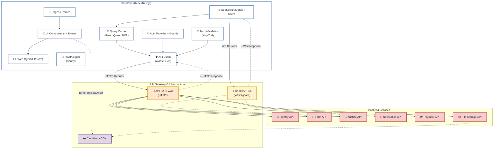

# Frontend Architecture Diagram

```mermaid
graph TB
    subgraph FE["FrontEnd (React/Next.js)"]
        direction TB
        Pages["📄 Pages / Routes"]
        Components["🎨 UI Components + Tokens"]
        State["📊 State Mgmt (UI/Form)"]
        Query["💾 Query Cache<br/>(React Query/SWR)"]
        Auth["🔐 Auth Provider + Guards"]
        Form["📝 Form/Validation<br/>(Yup/Zod)"]
        Toast["🔔 Toast/Logger<br/>(Sentry)"]
        SocketClient["🔌 WebSocket/SignalR Client"]
        ApiClient["🌐 API Client<br/>(Axios/Fetch)"]
        
        Pages --> Components
        Components --> State
        Query --> ApiClient
        Auth --> ApiClient
        Form --> ApiClient
        SocketClient --> Query
    end

    subgraph Gateway["API Gateway & Infrastructure"]
        direction TB
        APIGW["🚪 API GATEWAY<br/>(HTTPS)"]
        RealtimeHub["⚡ Realtime Hub<br/>(WS/SignalR)"]
        Cloudinary["☁️ Cloudinary CDN"]
    end

    subgraph Backend["Backend Services"]
        direction TB
        IdentityAPI["👤 Identity API"]
        FarmAPI["🚜 Farm API"]
        AuctionAPI["🔨 Auction API"]
        NotificationAPI["📢 Notification API"]
        PaymentAPI["💳 Payment API"]
        FileStorageAPI["📦 File Storage API"]
    end

    %% Frontend to Gateway connections
    ApiClient -->|"HTTPS Request"| APIGW
    APIGW -.->|"---HTTP Response"| ApiClient
    SocketClient -->|"WS Request"| RealtimeHub
    RealtimeHub -.->|"---WS Response"| SocketClient
    Components -.->|"Direct Upload/Asset"| Cloudinary

    %% Gateway to Backend Services
    APIGW --> IdentityAPI
    APIGW --> FarmAPI
    APIGW --> AuctionAPI
    APIGW --> NotificationAPI
    APIGW --> PaymentAPI
    APIGW --> FileStorageAPI

    %% Realtime Hub to Services
    RealtimeHub -.-> AuctionAPI
    RealtimeHub -.-> NotificationAPI

    %% File Storage to Cloudinary
    FileStorageAPI -.-> Cloudinary

    %% Styling
    classDef frontend fill:#dae8fc,stroke:#6c8ebf,stroke-width:2px
    classDef gateway fill:#ffe6cc,stroke:#d79b00,stroke-width:3px
    classDef realtime fill:#fff2cc,stroke:#d6b656,stroke-width:3px
    classDef cdn fill:#e1d5e7,stroke:#9673a6,stroke-width:3px
    classDef backend fill:#f8cecc,stroke:#b85450,stroke-width:2px
    classDef feComponent fill:#ffffff,stroke:#6c8ebf,stroke-width:2px

    class FE,Pages,Components,State,Query,Auth,Form,Toast,SocketClient,ApiClient feComponent
    class APIGW gateway
    class RealtimeHub realtime
    class Cloudinary cdn
    class IdentityAPI,FarmAPI,AuctionAPI,NotificationAPI,PaymentAPI,FileStorageAPI backend
```

